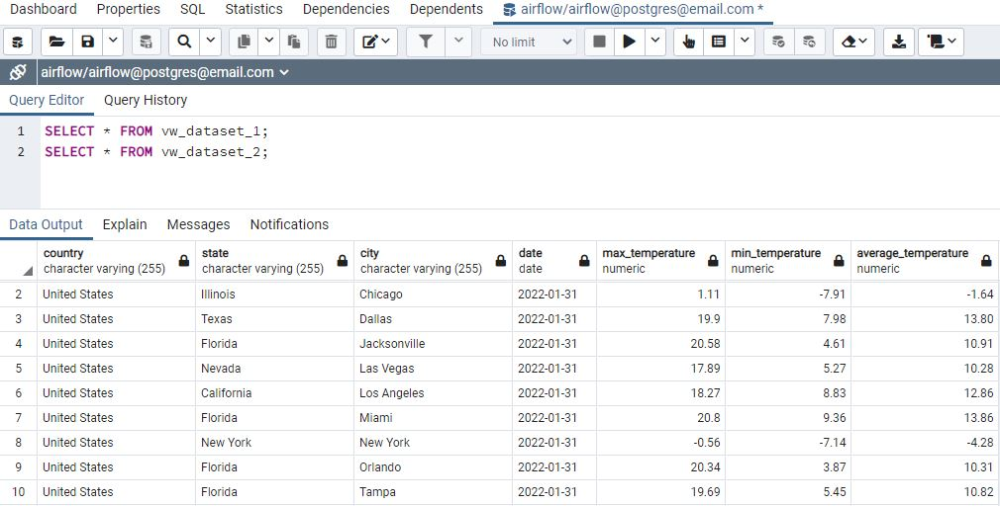

# Apache Airflow data pipeline
## Consuming Weather API and Storing on PostgreSql Database.

### This set of code and instructions has the porpouse to instanciate a compiled environment with set of docker images like airflow webserver, airflow scheduler, postgresql, pyspark.

## Overview
Extract the last 5 days of data from the free API: https://api.openweathermap.org/data/2.5/onecall/timemachine (Historical weather data) from 10 different locations.  

Build a repository of data where we will keep the data extracted from the API. This repository should only have deduplicated data. Idempotency should also be guaranteed.  
  
Build another repository of data that will contain the results of the following calculations from the data stored in step 2.  
A dataset containing the location, date and temperature of the highest temperatures reported by location and month.  
A dataset containing the average temperature, min temperature, location of min temperature, and location of max temperature per day.  
Remote Infrastructure with all components required to the python workflow works.  
  
  
The set of scripts in Airflow DAG takes care of extracting historical data from the weather API based on 10 different location (5 days per location) and store it locally, light pre processing data and lookup with geopy API to enrich data with locations, store pre processed json files locally also, then the medium effort processing work is send to Spark local through airflow Spark Submit, where the spark script is sent to the local spark cluster, do all the data processing, filtering, aggregations and store back locally in the filesystem, then once the files are stored back as csv files, it runs postgres scripts to copy from (ingest) files to the postgres sql database, finally views are created with the aggregated queries in order to attend the request.     

In Addition, the Dockerfile and docker-compose file scripts are in charge of spining up containers with everything needed to run the airflow DAG successfully end to end.  
    
  
## Requirements
* Linux Operational System (Ubuntu 20.04 Prefered) or Windows and docker desktop.
* [Git Versioning Software ](https://git-scm.com/download/linux)
* [Docker Container Virtualization Software](https://docs.docker.com/engine/install/ubuntu/)
* [Docker-Compose multi-container Docker applications](https://docs.docker.com/compose/install/)


# Instructions
Clone this repository into your linux working directory and navegate into it.  
  
run commands:
```
# Create Local Folder and give permissions
sudo mkdir airflow && sudo chmod -R 777 airflow && cd airflow

# Clone Git repository to the created folder
git clone https://github.com/mpavanetti/weather_pipeline .

# Run docker compose
sudo docker-compose up -d

# Import Airflow connections and variables
docker exec -it airflow-airflow-scheduler-1 airflow connections import /opt/airflow/variables/airflow_connections.json
docker exec -it airflow-airflow-scheduler-1 airflow variables import /opt/airflow/variables/airflow_variables.json

# Add permissions
sudo chmod -R 777 ../airflow
```
  
In case you have any issues while importing airflow connections and variables, take the json files and import it manually.  
  
Note that you can enter manually latitude and logitude in the airflow varaibles one by one, open the file [airflow_variables.json](airflow_variables.json) and change the parameters weather_data_lat and weather_data_lon respectively or you if you let it as blank, the script will suggest 10 different location.  

Note that the temperature results are in Celsius(units=metric), if you want to change to Fahrenheit open the variable file [airflow_variables.json](airflow_variables.json) and change the parameter weather_data_units to imperial. respectively standard for Kelvin.  

*Important, to Change the variables you can go at the variables section in apache airflow and change the values as you want any time you need or either do in the [airflow_variables.json](airflow_variables.json) and redeploy the containers which might not be very fast.


## Accesses
Access the Airflow UI through the link http://localhost:8080/  

Username: airflow  
Password: airflow
  
Access Postgres Admin through the link http://localhost:15432/  
Username: postgres@email.com  
Password: postgres
  
Note: using localhost as example, in case the application sits on cloud virtual machines, the host will be given at your cloud machine instance, also make sure the ports are opened.
  
  
## Data Pipeline Run
Go to airflow DAGs view , turn on the dag weather_data, and trigger it.  


## Checking DAG result

Open the postgres admin in a chrome web browser, go to Servers and add a server with the information described in the json file [pgadmin.json](pgadmin.json)
  
Check the final views  

SELECT * FROM VW_DATASET_1;  

SELECT * FROM VW_DATASET_2;  
  
After running the airflow DAG pipeline, you should expect the following view result in postgresl:  
  


Thanks.  
 

## Extra notes

```
# Install docker-compose v2 on linux os  
sudo curl -L https://github.com/docker/compose/releases/download/v2.17.2/docker-compose-linux-x86_64 -o /usr/local/bin/docker-compose
sudo chmod +x /usr/local/bin/docker-compose

# Install tiny file manager
sudo docker run -d -v ./filemanager:/var/www/html -p 80:80 -v ./dags:/var/www/html/data/dags -v ./logs:/var/www/html/data/logs -v ./plugins:/var/www/html/data/plugins --restart=always --name filemanager tinyfilemanager/tinyfilemanager:master

Default username/password: admin/admin@123 and user/12345

# Airflow 2.5.3 with celery
docker-compose -f docker-compose-celery.yaml up -d
```
