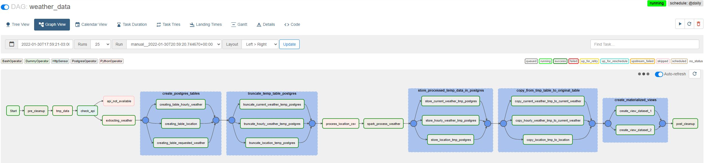

# Instance of Apache Airflow and PySpark

## This set of code and instructions has the porpouse to instanciate a compiled environment with set of docker images like airflow webserver, airflow scheduler, postgresql, pyspark.
  

# Instructions
Clone this repository into your linux working directory and navegate into it.  
  
run command:
```
docker-compose up -d
```

## Access
Access the Airflow UI through  the link http://localhost:8080/  

Username: airflow  
Password: airflow

## Importing Variables

Go to the variable section in airflow and import [airflow_variables.json](airflow_variables.json) file into tha import section.
  
  
## Importing Connection
Go to the connection section and add manually the following entries:

### Database Postgres:
Conn Id: postgres_default  
Conn Type: Postgres  
host: postgres  
schema: airflow  
Login: airflow  
Password: airflow  
Port 5432  

### Weather Api
Conn Id: openweathermapApi  
Conn Type: HTTP  
host: https://api.openweathermap.org/  
password: 2647339921cbe5b6eab93ee70ab23453  


## Data Pipeline Run
Go to airflow DAGs view , turn on the dag weather_data, and trigger it.  


